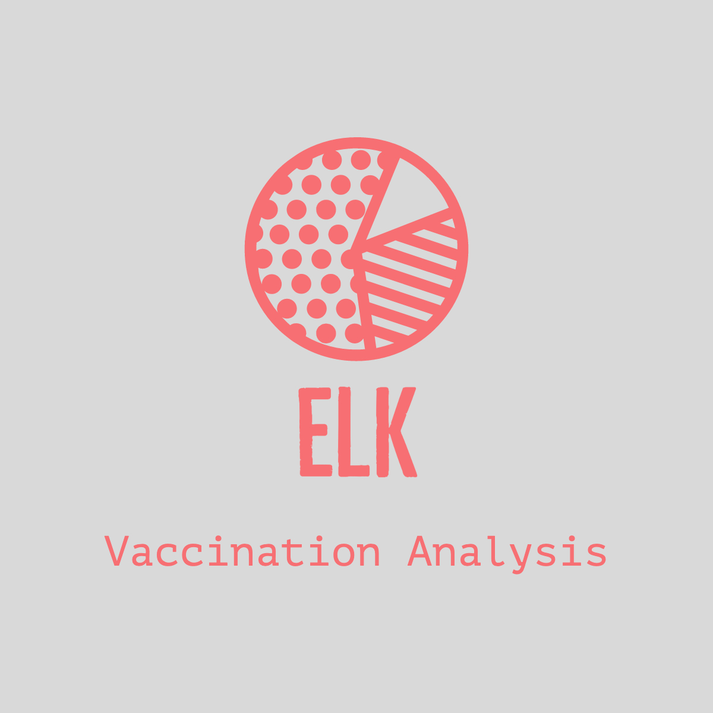
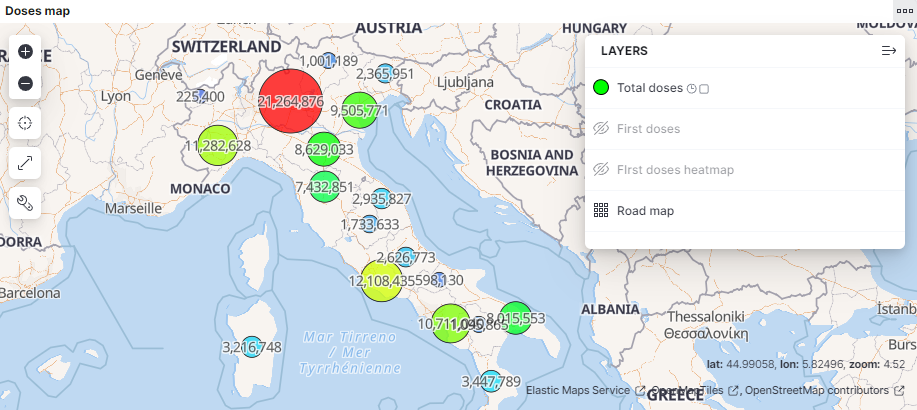
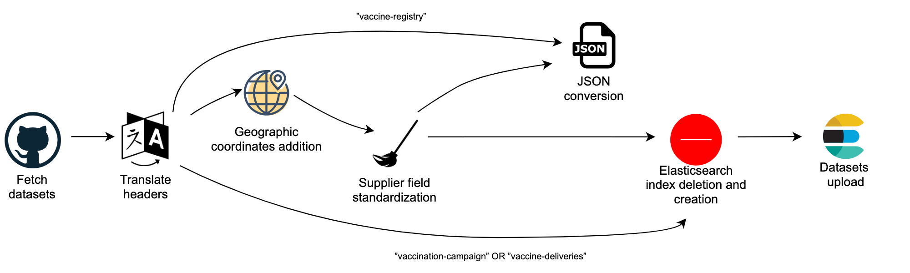

<p align="center">
  <i><span style="font-size: small;">
  	Systems and Methods for Big and Unstructured Data - Delivery #3 - AA 2021/2022 - Prof. Marco Brambilla
  </span></i>
</p>
<h1 align="center">
	<strong>
	ELK Vaccination Campaign Analysis System
	</strong>
	<br>
</h1>
<p align="center">
<span style="font-size: small; ">
		<a href="https://www.elastic.co/what-is/elk-stack">ELK</a>		 
		•		
		<a href="Report.pdf">Report</a>   
	</span>
</p>

<p align="center">
  
</p>

Considering the scenario in which there’s the need to build a system suitable for analysis over 
data about COVID-19 vaccination statistics, we designed and build a Kibana visualization 
tool relying on the ELK stack. The data stored allows extracting actionable insights 
concerning various statistical purposes, involving information such as vaccine deliveries, 
administered doses amounts, suppliers and age groups. 
The third-part data imported into the database is updated daily as it concerns vaccination campaign 
and so it has been also used to build insightful dashboards providing visualization at various levels 
of granularity.

We focused on the Italian vaccination campaign by relying on the daily updated open data about delivery and administration of **COVID-19** vaccines provided by the <a href="https://www.salute.gov.it">**Italian Ministry of Health**</a>. Of the data available at <a href="https://github.com/italia/covid19-opendata-vaccini">this Github repository</a> only three datasets were picked to feed the system.
The idea is to provide a tool aware of data updates, reason for why we implemented a small data processing pipeline to fetch, slightly change and standardize the data uploaded to the aforementioned repository. More details about this process can be found on the <a href="Report.pdf">Report</a>

# Contents

- ⚙  [System requirements️](#system-requirements)
- 🚀 [Setup instructions](#-setup-instructions)
- 📜 [Report](Report.pdf)
- 👨‍💻 [Usage](#-usage)
   	- [Enable Python Pipeline](#enable-Python-Pipeline)  
	- [Load Dashboards & Indexes](#load-dashboards--indexes)
- 🗄️ Dumps
  - 🗄️ [Dashboards dump](Exports/Dashboards)
  - 🗄️ [ES Indexes Patterns dump](Exports/Indexes) 
- 📷 [Dashboards](#-dashboards)  
- ♻️ [Data pipeline](#-Data-pipeline)
- 📝 [License](#-license)

# System requirements

## Required software

- [Python](https://www.python.org/) 3.8 or higher
- [Elasticsearch](https://www.elastic.co/elasticsearch/)
- [Kibana](https://www.elastic.co/kibana/)  
- Python modules in [requirements.txt](requirements.txt)


# 🚀 Setup instructions

## Clone the repo

    git clone https://github.com/pablogiaccaglia/elastichsearch-vaccination-campaign
    cd elasticsearch_smbud/

## Install required packages

From the project's directory run the following commands:

    pip install -r requirements.txt
    
# 👨‍💻 Usage

## Enable Python pipeline

The idea behind the provided Python scripts is to enable a small data processing pipeline to daily update vaccination campaign data. More information can be found on the [Data pipeline](#-Data-pipeline) section and on the <a href="Report.pdf">Report</a>

The first step to accomplish is to establish a connection to Elasticsearch.
The provided code relies on an **Elastic Cloud** based connection, but it can easly customized to serve different connection types, as shown <a href="https://www.elastic.co/guide/en/elasticsearch/client/python-api/master/connecting.html">here</a>.

In the <code><a href="setup.ini">setup.ini</a></code> file you just need to change the following placeholder info with your own:

```dosini
[ELASTIC-API]
cloud_id = CLOUD_API
apikey_id = APIKEY_ID
apikey_key = APIKEY_KEY
```
Then you just need to execute this <code><a href="main.py#L41">main</a></code> method to trigger the daily routine which updates the database.

## Load Dashboards & Indexes

To visualize and interact with Kibana dashboards you need to import the json files avilable here:

  - 🗄️ [Dashboards dump](Exports/Dashboards)
  - 🗄️ [ES Indexes Patterns dump](Exports/Indexes) 

Then all you have to do is:

1. Open Kibana

2. Visit the Saved Objects section accessed via Management > Stack Management

3. In the top-right menu, you should see Import, which should allow you to upload an exported JSON/ndjson file


</p>


# 📷 Dashboards

In the following chapter we are describing the Kibana dashboards we implemented. We used different indexes and we also tried to cover different ways of representation (bar charts, maps, pie charts) and different functions (cumulative sums, total sums, daily data). Most of the dashboards are interactive: this means you can select an interval with the left click of the mouse and the graph will zoom into it; or for other types you can select/deselect some data (for example, in the map).

Note that even though in Italy the first vaccine against COVID-19 was administered on 27/12/2020, the following charts, <br> when the x-axis is divided into week intervals, the starting week is on /12/2020.


Weekly trend of the number of vaccinations       |  Vaccination status of all age groups
:-------------------------:|:-------------------------:
|  

---

Total number of doses delivered      |  Number of not vaccinated people
:-------------------------:|:-------------------------:
|  

---

Gender distribution of weekly vaccine doses administered           |  Doses map
:-------------------------:|:-------------------------:
|  

---

<h3><p align="center"><b>Distribution of suppliers of all administered vaccines</b></p></h3> 
	
<p align="center">

</p>

---
	
# ♻️ Data pipeline

We decided to build a Python data pipeline to provide a daily database update, while ensuring to be consistent with the modifications we applied to the original datasets. Obviously a manual approach isn't feasible for this purpose, so different steps taken into account by the daily routines are now briefly explained, referencing to a real use case scenario.

 <p align= "center">
 <kbd> 
 
 </kbd>
 </>

	
- **Datasets fetch from Github repository** :  **CSV files** are updated (<a href="https://github.com/italia/covid19-opendata-vaccini">here</a>) every day at around **5:15 AM**, then some sort of watcher-notifier tool (not integrated at the moment), such as <a href="https://app.github-file-watcher.com">**GitHub File Watcher**</a> could trigger the daily routines functions (implemented), whose first step is the files fetch for processing.
    
 - **CSV Header translation**: the original CSV files' headers are in Italian, so we decided to translate them in English to widen the audience of users. This modification doesn't affect the content of the datasets and it is easily adaptable to header names changes, since the translation is performed daily through a lookup table (**Python Enum subclass**) which can be easily changed through add-ons, modifications and deletions.
    File names were also translated, and the resulting names are: "vaccination-campaign" for **"somministrazioni-vaccini-latest"**, **"vaccine-registry"** for **"anagrafica-vaccini-summary-latest"** and "vaccine-deliveries" for  **”consegne-vaccini-latest”**. Note that these translations correspond to the **Elasticsearch** Indexes names and from now these document and their fields will be named after their English translation.
    
- **Adding region coordinates**: This addition is performed only on **"vaccine-deliveries"** and **"vaccination-campaign"** datasets, since these contain a **"region name"** field, through which is possible to associate the corresponding region coordinates as a pair. The coordinates are retrieved from a previously created file containing mappings of Italian regions to their corresponding coordinates, retrieved through the **GMaps Geocoding API**. This information doesn't alter the original data and is used to provide **Kibana** Geo data visualizations of the vaccination campaign. Note that this operation is performed by a Python function that lets choosing the way in which the data is added: through a single CSV column named **"region\_coordinates"** or through 2 CSV columns named **"region\_longitude"** and **"region latitude"**, containing the corresponding float values.
    This addition is compatible with the daily updates, since we assume that it is unlikely a change of the **"region\_name"** filed values. But if there will be such case, for example concerning lower/upper case characters, it is almost immediate to face it by changing the lookup table region names, or by writing appropriate functions to face multiple scenarios.
    
- **Supplier filed "standardization"**: This is the only significant modification we applied to two of the original datasets: **"vaccination-campaign"** and **"vaccine-deliveries"**. The alteration involves **"supplier"** field of both datasets, whose values are the names of vaccine's suppliers, e.g: **Pfizer/BioNTech, Moderna**. In detail among the possible values of this textual field there are **"Pfizer/BioNTech"** and **"Pfizer Pediatrico"**, that is "Pediatric Pfizer". Since we don't consider this distinction meaningful for the insight we want to provide the user through this system, we decided to standardize both fields under the name of the former. Note that also in this case same reasoning done for the previous step concerning daily updates and format changes can be applied.
    
- **Datasets upload to Elasticsearch**: After the data manipulation phase, some additional steps are taken to successfully upload the data. Firstly the three indexes, if previously created, are deleted from Elasticsearch, then recreated to upload the newer data from the final CSVs. This step, which could sound not optimal, is taken because we noticed eventual updates of older data (e.g number of doses amount was partial). Even though more sophisticated solutions involving detection changes methods and upload of only new/changed entries could be adopted, we didn't do that to focus on other aspects of the project.
    
- **Additional notes**: Through the provided Python routines in the last step of the process, final CSVs are converted to Json format for eventual further usages. The datasets are uploaded online through <a href="https://github.com/elastic/elasticsearch-dsl-py">**Elasticsearch DSL Python library**</a>, manual mapping is performed in this phase for 2 reasons: aim to have uploaded data ready for interaction without further tweaks and to have full control on data types, to avoid eventual unwanted automatic mappings and to specify Keyword fields, to perform aggregation both in Elasticsearch queries and Kibana dashboards on textual fields.


# 📝 License

This file is part of "ELK Vaccination Campaign Analysis System".

"ELK Vaccination Campaign Analysis System" is free software: you can redistribute it and/or modify
it under the terms of the GNU General Public License as published by
the Free Software Foundation, either version 3 of the License, or
(at your option) any later version.

"ELK Vaccination Campaign Analysis System" is distributed in the hope that it will be useful,
but WITHOUT ANY WARRANTY; without even the implied warranty of
MERCHANTABILITY or FITNESS FOR A PARTICULAR PURPOSE.  See the
GNU General Public License for more details.

You should have received a copy of the GNU General Public License along
with this program (LICENSE.txt).  If not, see <http://www.gnu.org/licenses/>
